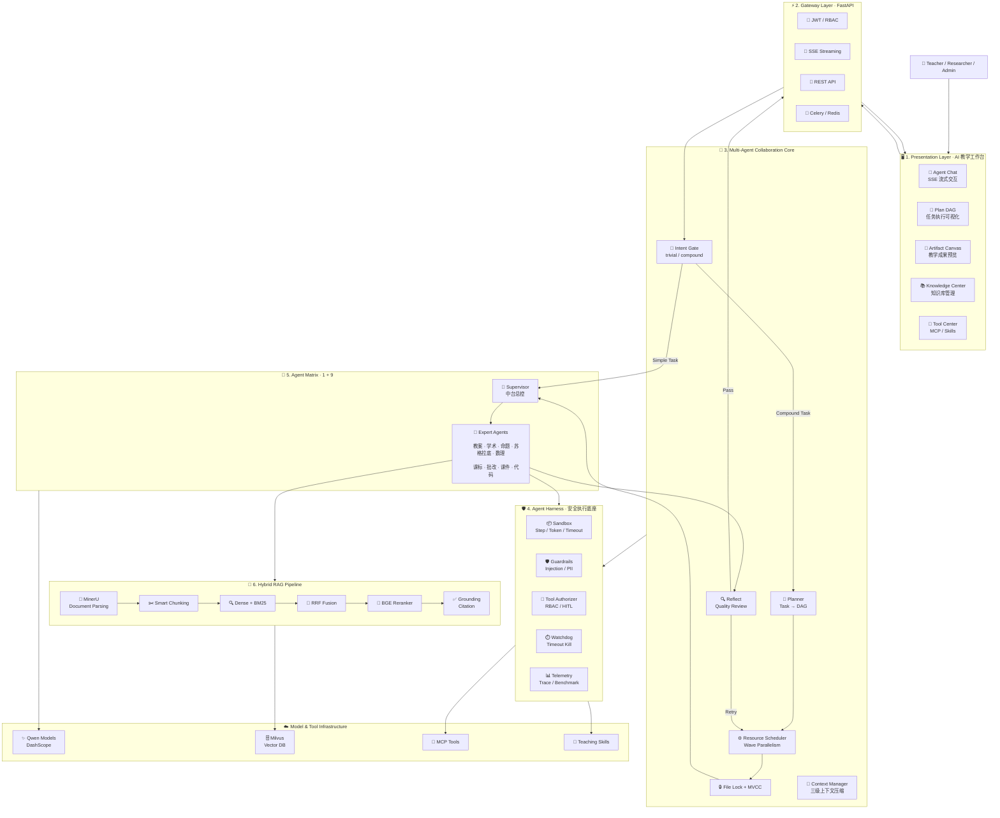
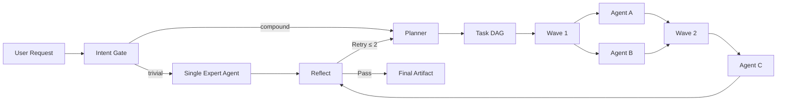
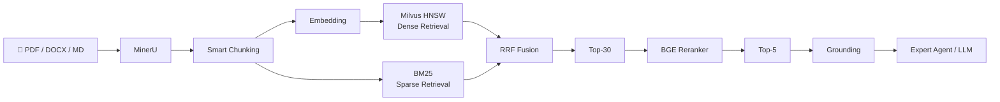

# 智学中台 (EduAgent-Platform) · AI 数字化教育赋能平台

[](https://www.python.org/)
[](https://fastapi.tiangolo.com/)
[](https://milvus.io/)
[](https://bailian.console.aliyun.com/)
[-black.svg)](https://nextjs.org/)

---

## 📖 项目概述

**智学中台（EduAgent-Platform）** 是一套面向教育教学全流程的**产业级垂直 AI 中台**。系统底层整合阿里百炼（DashScope）通义千问大模型矩阵与 Milvus 2.4 向量数据库，以自研 **Agent Harness（智能体驾驭与安全护栏底座）** 兜底全部执行过程；上层由**中台总控智能体**统一接收需求，通过意图门控分流——简单任务单 Agent 直达、复杂任务调度 **9 大学科专家智能体**协同完成，覆盖新课标教案设计、高考试卷命制、数理公式推导、学术文献研读、代码自动批改与苏格拉底启发式辅导。

### 🎯 核心实测指标

* **Top-5 召回率 65% → 93.4%**：MinerU 版面解析 + 公式保护分块 + BM25/Milvus 混合检索（RRF 融合）+ BGE-Reranker 重排；
* **幻觉发生率降低 30%+**：Grounding 事实接地校验 + 引用溯源；专业理科 QA 准确率提升 25%；
* **公式排版零断裂**：MinerU 保留 LaTeX 原语与表格完整性，杜绝硬截断残缺；
* **外部调用零悬挂**：Watchdog 强杀机制（LLM 90s / 流式空闲 30s / Embedding 35s / 沙箱 20s）。

---

## 🏛️ 系统总体架构

EduAgent-Platform 采用 **分层式 Agentic AI 架构**，围绕「用户交互 → 任务理解 → 多智能体编排 → 安全执行 → 知识增强 → 结果交付」构建完整的教育智能体执行链路。

系统并非简单的 LLM 对话封装，而是由 **AI 工作台、API 网关、Multi-Agent 协作引擎、Agent Harness、专家智能体矩阵与 Hybrid RAG** 共同组成的教育垂类 AI 中台。

### Architecture Overview



---

### 🔄 核心执行链路

EduAgent-Platform 根据任务复杂度采用 **单 Agent 直达 + Multi-Agent DAG 协作** 的双路径执行机制。

```text
User Request
     │
     ▼
┌─────────────────────┐
│     Intent Gate     │
│ trivial / compound  │
└─────────┬───────────┘
          │
     ┌────┴────┐
     │         │
 trivial    compound
     │         │
     ▼         ▼
Single Agent   Planner
     │         │
     │         ▼
     │      Task DAG
     │         │
     │         ▼
     │   Resource Scheduler
     │         │
     │    Wave Parallel
     │         │
     └────┬────┘
          ▼
    Expert Agents
          │
          ├──────────► Hybrid RAG
          │
          ├──────────► MCP Tools
          │
          ├──────────► Teaching Skills
          │
          └──────────► Code Sandbox
          │
          ▼
       Reflect
          │
     ┌────┴────┐
     │         │
    Pass      Retry
     │         │
     ▼         └──────► Scheduler
Artifact
     │
     ▼
SSE Streaming
     │
     ▼
     User
```

简单任务由专业 Agent 直接处理，避免不必要的规划开销；复合任务则进入 **Plan → DAG → Resource Scheduler → Multi-Agent → Reflect** 协作链路，并根据资源依赖关系进行拓扑分层和波次并行执行。

---

### 🧩 分层架构

| Layer | 核心组件 | 职责 |
| :--- | :--- | :--- |
| **Presentation** | Next.js · React · Artifact Canvas | 对话交互、Plan DAG、公式渲染、知识库与成果展示 |
| **Gateway** | FastAPI · JWT · SSE · Celery | API 接入、认证鉴权、流式输出与异步任务 |
| **Collaboration Core** | IntentGate · Planner · Scheduler · Context Manager | 意图识别、DAG 规划、资源调度、上下文治理 |
| **Agent Harness** | Sandbox · Guardrails · Authorizer · Watchdog | Agent 执行安全、工具权限、超时熔断与运行监控 |
| **Agent Matrix** | Supervisor + 9 Expert Agents | 教案、学术、命题、数理、批改等专业任务执行 |
| **Knowledge / RAG** | MinerU · Milvus · BM25 · RRF · BGE | 文档解析、混合召回、重排与事实接地 |
| **Infrastructure** | Qwen · MCP · Redis · PostgreSQL / SQLite | 模型、工具、缓存、任务队列及持久化基础设施 |

---

### 🧠 Multi-Agent Orchestration

系统以 **Supervisor（中台总控）** 为统一入口，根据任务复杂度动态选择执行模式：



其中复合任务首先被拆解为 DAG，并按照依赖关系进行拓扑分层；同一 Wave 内满足资源条件的任务可以并行执行。

资源调度阶段采用：

> **Health Gate → Concurrency Slot → File Lock / Version Pin**

三闸准入机制，并通过文件区域锁、MVCC 快照与冲突 Rebase 避免多个 Agent 并发修改同一教学成果时产生覆盖冲突。

---

### 🔎 Hybrid RAG Architecture

知识增强链路采用 **Dense Retrieval + Sparse Retrieval + RRF + Reranker + Grounding** 的多阶段检索架构：



核心检索流程：

```text
Document
   ↓
MinerU Layout Parsing
   ↓
Formula / Table Preservation
   ↓
Smart Chunking
   ↓
┌──────────────────────┐
│                      │
▼                      ▼
Milvus HNSW           BM25
Dense Retrieval       Sparse Retrieval
│                      │
└──────────┬───────────┘
           ▼
       RRF Fusion
           ↓
        Top-30
           ↓
     BGE Reranker
           ↓
         Top-5
           ↓
       Grounding
           ↓
Citation-aware Answer
```

---

### 🛡️ Agent Harness

所有 Agent、模型和外部工具调用统一经过 **Agent Harness**，将安全、权限、超时和可观测能力从具体 Agent 逻辑中解耦。

```text
                    Agent
                      │
                      ▼
            ┌──────────────────┐
            │  Agent Harness   │
            ├──────────────────┤
            │ Sandbox          │
            │ Guardrails       │
            │ Tool Authorizer  │
            │ Call Fingerprint │
            │ Watchdog         │
            │ Telemetry        │
            │ Benchmark        │
            └────────┬─────────┘
                     │
        ┌────────────┼────────────┐
        ▼            ▼            ▼
      LLM          MCP Tool    Code Sandbox
```

Harness 负责统一实施：

- **Execution Sandbox**：Step、Token 与执行时间预算；
- **Safety Guardrails**：Prompt Injection 检测、教育内容合规与 PII 脱敏；
- **Tool Authorizer**：基于角色的 RBAC 权限控制与高风险操作 HITL 审批；
- **Call Fingerprint**：工具调用指纹去重，避免重复执行与死循环；
- **Watchdog**：对 LLM、Embedding、Streaming 与 Sandbox 调用执行硬超时；
- **Telemetry / Benchmark**：记录 Agent Step、Token、耗时和质量评测指标。

---

### 💡 Architecture Highlights

> **EduAgent-Platform 的核心并不是“多个 Agent 调用多个 Prompt”，而是将 Agent 作为可调度、可治理、可观测的执行单元。**

整体架构围绕四个核心目标设计：

1. **Orchestration** — Intent Gate + DAG + Wave Scheduler 实现动态多智能体协作；
2. **Knowledge** — Hybrid RAG 为专业 Agent 提供可溯源的领域知识；
3. **Safety** — Agent Harness 对模型、工具与代码执行实施统一安全治理；
4. **Context** — Structured State + Context Compressor 支撑长周期、多步骤 Agent 任务。

---

## 🧠 Multi-Agent 协作核心机制

中台总控智能体不是固定流水线，而是一套带资源治理的通用协作引擎，包含四项机制：

### 1. 意图门控（Intent Gate）

* 轻量模型（`qwen-turbo`）对用户消息做 `trivial / compound` 二分类，输出 JSON 决策；
* **trivial（简单任务）**：绕过 Plan 规划，直接派发给单个专业 Agent 直达，省规划成本；
* **compound（复合任务）**：进入 Plan → DAG 调度多 Agent 协作；
* LLM 不可用时自动降级为关键词规则分类（复用复合请求判定 + Agent 路由表）。

### 2. 并行冲突避免（文件锁 + 版本控制）

| 组件 | 文件 | 机制 |
| :-- | :-- | :-- |
| FileResourceManager | `file_resource_manager.py` | 区域写锁 X：按章节区域判定重叠，**不同章节写可并行**；读锁 S 在 MVCC 下立即授予；Lua 脚本 token 校验防误释放；租约 30s + renew 心跳 |
| FileVersionStore | `file_version_store.py` | SQLite 不可变版本链；reader pin 快照不受新提交影响；提交时 base 落后且变更区域重叠 → 抛 `FileConflictError`；区域不重叠直接放行 |

### 3. 协作任务调度（Resource Scheduler）

* DAG 拓扑分层，每层作为一个**波次（wave）**内并行执行；
* **三闸准入**：健康闸 → 并发信号量槽 → 文件锁/版本 pin；锁等待以异步超时挂起，不阻塞同波次兄弟任务；
* 写任务执行后统一提交版本；冲突时**自动 rebase 重跑同一节点**（上限 2 次）；
* 任务通过 `resources: {file_id, mode, section_range}` 声明式表达资源需求。

### 4. 上下文过长压缩（Context Compressor）

按 Token 预算水位逐级触发，**三级压缩**：

* **L1（水位 0.7）规则裁剪**：单条消息截断保留首尾、去重；
* **L2（水位 0.8）滚动摘要**：turbo 模型将旧消息压成结构化要点（facts / decisions / open_items / narrative），**原文先归档再压缩**；
* **L3（水位 0.9）归档召回**：最旧消息只留指针；首条用户指令、system、公式表格、最近 3 轮永久豁免；
* `recall(query)` 用字符二元组匹配零成本召回归档内容；归档 TTL 7 天。

### 质量评审（Reflect）

每轮执行后由重模型评审结果质量；不通过则针对缺口补执行任务，**最多 2 轮**（任务按 `R{轮}_{序}` 编号、每轮重新评审），达上限输出当前最优结果，杜绝无限回退。

---

## 🤖 智能体矩阵（1 + 9）

| 智能体 | ID | 定位 | 核心产出 |
| :-- | :-- | :-- | :-- |
| **中台总控** | supervisor | 意图门控、DAG 规划、资源调度、质量评审 | 协同编排 + 合并输出 |
| 教案大师 | lesson_plan | 新课标教案/导学案分步设计 | LESSON_PLAN（可导出 Word） |
| 学术研读 | academic_rag | 文献深度研读，混合检索 + 幻觉校验 | 学术综述 + 引用锚点 |
| 命题组卷专家 | exam_quiz | 自适应难度梯度命卷，附评分细则 | 标准化试卷 + 采分点 |
| 苏格拉底答疑 | socratic | 不直接给答案，反问启发 | 探究式引导链 |
| 数理推导 | math_solver | 微积分/几何/物理严谨 LaTeX 演算 | 分步推导（含定义域声明） |
| 课标素养对标 | curriculum | 新课标核心素养渗透审查 | 素养诊断报告 |
| 主观题批改 | rubric | 中高考阅卷量规（Rubric）批阅 | 分项得分 + 升格范文 |
| 课件大纲 | slide_outline | 教案提炼为演示文稿结构 | 逐页 PPT 大纲 |
| **代码批改** | code_grader | **沙箱真跑测试用例** + AST 静态预检 | 测试通过率 + 代码诊断 |

---

## 🔎 高级混合 RAG 流水线

```
文档 → MinerU 版面解析(OCR/公式LaTeX/表格MD)
     → 分块(6 策略: semantic/fixed/markdown_header/qa/recursive/sentence)
     → text-embedding-v3 向量化(1024 维)
     → Milvus HNSW 稠密召回 ‖ BM25 稀疏精确召回
     → RRF 倒数排名融合(初筛 Top-30)
     → BGE-Reranker-Large Cross-Encoder 精排(Top-5)
     → Grounding 事实接地校验 + 引用锚点
```

* **动态分块配置**：按文档类型自动映射策略（PDF→semantic 512+64 / MD→markdown_header / TXT→recursive 等），前端支持参数滑块与 Dry-run 切片预览；
* **Milvus 集合** `edu_knowledge_chunks`：HNSW（M=16, efConstruction=200）+ 学科/学段倒排索引；
* **降级模式**：无 Milvus 时自动切换内存向量库（cosine 相似度），检索功能不中断。

---

## 🛡️ Agent Harness 安全底座

| 组件 | 文件 | 作用 |
| :-- | :-- | :-- |
| Execution Sandbox | `harness/sandbox.py` | max_steps=15、token_budget=16000、120s 三道硬熔断 |
| Safety Guardrails | `harness/guardrails.py` | Prompt 越狱注入拦截、教育合规审查、PII（手机/身份证）脱敏 |
| Tool Authorizer | `harness/authorizer.py` | 按角色（Admin/Teacher/Researcher）做工具 RBAC 门禁，高危操作 HITL 挂起审批 |
| Call Fingerprint | `harness/fingerprint.py` | SHA256(工具名+规范化参数) 指纹去重，同任务内等价调用短路，防死循环 |
| Watchdog Timeout | `harness/timeout.py` | 外部调用强杀：LLM 90s / 流空闲 30s / 流总 150s / Embedding 35s / 沙箱 20s |
| Telemetry | `harness/telemetry.py` | 每 step 耗时/Token/状态追踪，可推送 Langfuse |
| Benchmark | `harness/benchmark.py` | 召回率、幻觉率、LaTeX 闭合率自动化回归评测 |

---

## 🎨 前端设计

### 页面

| 路由 | 功能 |
| :-- | :-- |
| `/` | 智能体对话工作台（默认中台总控） |
| `/login` | 全屏品牌背景 + 右侧白色玻璃拟态登录卡片（毛玻璃 backdrop-blur + 淡入上移动画） |
| `/knowledge` | 知识库中心：文档/切片浏览、动态分块配置、检索 Playground |
| `/tools` | 教学工具中心：MCP 与技能双 Tab 广场、分类筛选、动态参数表单、试运行抽屉 |

### 交互特性

* SSE 流式：思考轨迹折叠面板（ThinkingAccordion）、Plan DAG 节点状态实时更新（RUNNING→DONE）、Token 级打字效果；
* KaTeX 实时渲染 `$...$` / `$$...$$`；文献引用 Hover 浮层；
* 教学成果（Artifact Canvas）右侧滑出，支持导出 Word（python-docx）与 PDF（reportlab）。

### 登录 / 退出语义

* **退出登录**：清除 Token 的同时清空全部智能体的 `last_session:*` 停留记忆；
* **重新登录**：始终进入中台总控智能体的**全新对话**（仅欢迎词、无历史记录）；历史记录保留在下拉中可手动打开。

---

## 🧰 MCP 工具总线与教学技能

### 14 个 MCP 工具（4 组）

| 分组 | 工具 |
| :-- | :-- |
| 精确计算 | Wolfram 符号计算、电子表格公式计算、代码解释器 |
| 学术与联网 | ArXiv 检索、中文学术检索、联网搜索、网页抓取 |
| 学科教学 | 天气查询、多语词典翻译、视频字幕提取 |
| 创作与同步 | AI 课件配图、PPT 生成、思维导图、Canvas LMS 同步 |

### 15 个教学技能（5 环节）

* **备课设计**：单元整体设计、课时教案、板书设计、分层作业、课件大纲；
* **命题测评**：试卷命制、双向细目表；
* **批改分析**：量规评价、作业批改、班级学情分析；
* **教研沟通**：教研讲稿、教学反思、家长会发言；
* **效率工具**：LaTeX 公式校验、文档导出。

---

## 🚀 快速开始

### 方式一：本地研发调试

#### 后端（端口 8000）

```bash
cd backend
pip install -r requirements.txt

# 配置环境变量（至少填入 DASHSCOPE_API_KEY）
# Windows 下复制 .env.example 为 .env 并修改

python -m uvicorn app.main:app --host 0.0.0.0 --port 8000
```

接口文档：`http://localhost:8000/docs`

#### 前端（端口 3000）

```bash
cd frontend
npm install
npm run dev
```

访问 `http://localhost:3000`，演示账号：`teacher_demo` / `password123`。

#### 运行测试

```bash
cd backend
python -m pytest tests -v
```

测试套件覆盖：API、认证持久化、Harness、RAG、文档解析、代码批改、记忆服务。

### 方式二：Docker Compose 一键编排

```bash
docker compose -f docker/docker-compose.yml up -d
```

拉起服务：Milvus(etcd+minio+standalone)、PostgreSQL 16、Redis 7、后端、Celery Worker、Flower（:5555）、前端（:3000）。

---

## 🔌 降级运行说明

系统对重型外部依赖全部内置降级路径，缺依赖仍可运行核心功能：

| 依赖 | 降级方案 |
| :-- | :-- |
| Redis | 进程内内存字典（锁/幂等/checkpointer） |
| Celery | 进程内同步执行 |
| Milvus / pymilvus | 内存向量库 + cosine 相似度 |
| MinerU | python-docx / pypdf / 本地 Markdown 解析 |

> 持久化数据在降级模式下使用原生 SQLite：`backend/data/edu_platform.db`（用户、会话、教学记忆、文件版本）。

---

## 🧱 技术栈总表

| 层 | 技术 |
| :-- | :-- |
| 后端框架 | FastAPI 0.115 · Uvicorn · Pydantic v2 / pydantic-settings |
| 大模型 | 阿里百炼 DashScope：qwen-max / qwen3.5-plus / qwen-turbo；text-embedding-v3 |
| 多智能体 | 自研 Orchestrator（DAG 规划 + 资源波次调度）+ LangGraph 状态图 |
| 向量检索 | Milvus 2.4（HNSW）· rank_bm25 · RRF 融合 · BGE-Reranker |
| 文档处理 | MinerU API · python-docx · pypdf · reportlab |
| 数据/缓存 | SQLite（原生）· SQLAlchemy 2.0 · Redis 5 · Celery 5（eventlet 池） |
| 可观测 | Langfuse · 自研 Telemetry / Benchmark |
| 前端 | Next.js 14 · React 18 · TypeScript · TailwindCSS · lucide-react |
| 内容渲染 | react-markdown · remark-gfm / remark-math · rehype-katex · KaTeX |

---

## 📁 目录结构

```text
github_AI_education/
├── docker/                         # 容器编排 (docker-compose + Dockerfile)
├── backend/
│   ├── app/
│   │   ├── api/v1/                 # 路由: auth/agents/knowledge/conversations/
│   │   │                           #       memory/artifacts/mcp_skills
│   │   ├── core/                   # config / security / database / redis / celery
│   │   ├── harness/                # 安全底座: sandbox/guardrails/authorizer/
│   │   │                           #       fingerprint/timeout/telemetry/benchmark
│   │   ├── models/                 # 关系模型
│   │   ├── schemas/                # Pydantic 结构化 Schema
│   │   ├── services/
│   │   │   ├── agent/              # 协作引擎 ★
│   │   │   │   ├── orchestrator.py      # 门控分流/波次执行/Reflect
│   │   │   │   ├── intent_gate.py       # 意图门控
│   │   │   │   ├── resource_scheduler.py# 三闸准入/冲突 rebase
│   │   │   │   ├── file_resource_manager.py
│   │   │   │   ├── file_version_store.py
│   │   │   │   ├── context_compressor.py
│   │   │   │   ├── context_manager.py
│   │   │   │   ├── graph.py / state.py / sub_agent.py
│   │   │   │   └── specialized/         # 9 个专家智能体实现
│   │   │   ├── rag/                # 解析/分块/向量库/混合检索/重排/幻觉校验
│   │   │   ├── llm/                # 百炼客户端 + 模型路由
│   │   │   ├── mcp/                # MCP 工具注册表(14)
│   │   │   ├── skills/             # 教学技能库(15)
│   │   │   ├── sandbox/            # 代码沙箱 code_executor
│   │   │   ├── auth/ chat/ memory/ task_queue/
│   │   └── main.py
│   ├── data/edu_platform.db        # SQLite 持久化
│   └── tests/                      # pytest 测试套件
├── frontend/
│   ├── src/
│   │   ├── app/                    # 页面: page/login/knowledge/tools + globals.css
│   │   ├── components/             # sidebar/chat/canvas/memory
│   │   └── lib/api.ts              # API 客户端
│   └── public/                     # login.png(登录背景) / content.png(对话水印)
├── .env.example
└── README.md
```


## 📄 许可证

本项目采用 [Apache 2.0 License](LICENSE)。

