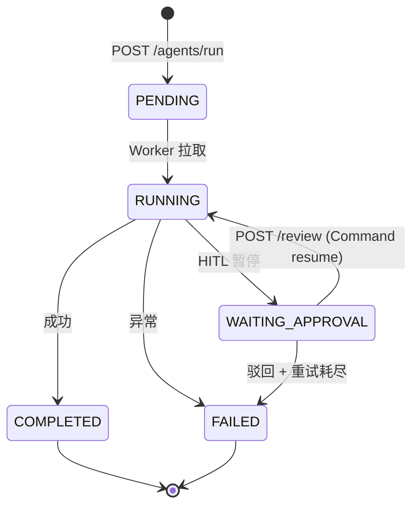
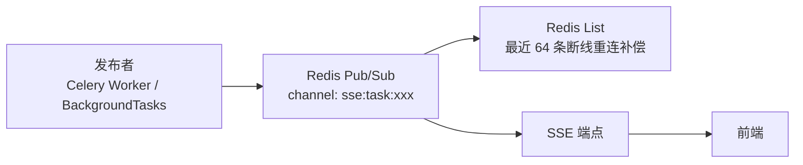

# 异步任务

## 任务生命周期



## 任务事件总线



- **Pub/Sub**：实时事件推送
- **List 暂存**：最近 64 条事件，断线重连时补偿
- **InProcEventBus**：Redis 不可用时的进程内兜底

## 跨进程恢复

HITL 暂停后，任务元数据写入 Redis：

```
task:{task_id}:status = WAITING_APPROVAL
task:{task_id}:conversation = {conversation_id}
task:{task_id}:metadata = {...}
```

FastAPI 进程收到 `POST /review` 时：

1. 查本地 `paused_runs` registry（进程内）
2. 如果不在本地 → 检查 `checkpointer_backend() == "redis"`
3. 如果是 Redis → 从 `redis_task_store` 恢复 conversation_id，调用 `Command(resume=)` 续跑
4. 如果是 Memory → 返回 503（无法跨进程恢复）
