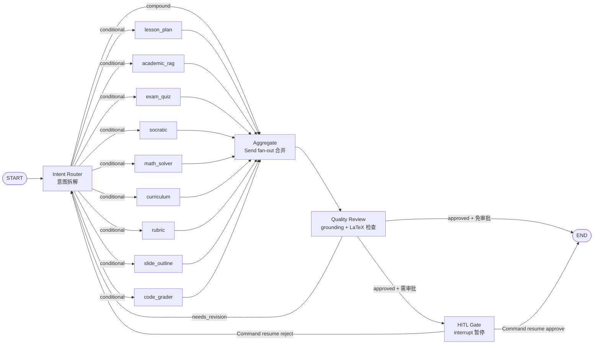
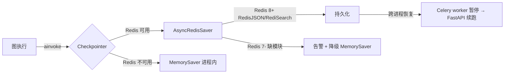

# LangGraph 工作流详解

## 图拓扑



## 节点详解

### 1. Intent Router（意图路由）

**职责**：分析教师消息，决定路由到哪个/哪些 agent。

**关键逻辑**：

```python
async def intent_node(state: AgentState, config: RunnableConfig):
    # 1. 用脱敏原文做意图分类（避免记忆 prompt 污染）
    raw_msg = state.get("raw_user_message") or state["messages"][-1]["content"]
    
    # 2. 复合任务关键词拆解
    decision = await supervisor_agent.route(state)
    
    # 3. 复合任务返回 Send 列表（并行 fan-out）
    if decision["compound"]:
        return [
            Send(agent, state) for agent in decision["sub_agents"]
        ]
    
    # 4. 单 agent 直接路由
    return {"next_agent": decision["next_agent"]}
```

**关键设计**：

- **脱敏原文**：复合任务拆解基于 `raw_user_message`（用户原始消息），避免 messages[-1] 含记忆 prompt 导致关键词误命中
- **关键词拆解 vs LLM 拆解**：默认关键词拆解（成本低），高复杂度场景可切 LLM
- **数学话题词不触发 math_solver**：「教案」「试题」等教学制品语境下的「函数」「几何」等词不应触发数学求解器

### 2. 9 个专业 Agent

| Agent | 文件 | 能力 |
|---|---|---|
| `lesson_plan` | `specialized/lesson_plan.py` | 教案生成（学情分析/教学目标/活动设计） |
| `academic_rag` | `specialized/academic_rag.py` | 学术 RAG（基于知识库的论文检索与解答） |
| `exam_quiz` | `specialized/exam_quiz.py` | 试卷组卷（按知识点/难度/题型配比） |
| `socratic` | `specialized/socratic.py` | 苏格拉底式提问（启发学生思考） |
| `math_solver` | `specialized/math_solver.py` | 数学求解（步骤化推导） |
| `curriculum` | `specialized/curriculum.py` | 课程大纲（学期/单元规划） |
| `rubric` | `specialized/rubric.py` | 评价量规（多维度评分标准） |
| `slide_outline` | `specialized/slide_outline.py` | 课件大纲（PPT 结构） |
| `code_grader` | `specialized/code_grader.py` | 代码批改（AST 安全沙箱 + 测试用例） |

**流式能力**：

```python
# 已实现 execute_stream 的 agent（lesson_plan/exam_quiz/code_grader）
async def execute_stream(self, state, on_token=None):
    async for chunk in llm.astream(messages, on_token=on_token):
        yield chunk

# 仅 execute 的 agent（socratic/math_solver）
# → TokenCounter 补偿：对最终文本分片补发打字机
await token_counter.compensate_if_silent(result["output"])
```

### 3. Aggregate（聚合节点）

**职责**：合并并行 agent 的结果到 `final_markdown_output`。

```python
async def aggregate_node(state: AgentState, config: RunnableConfig):
    sub_results = state.get("sub_results", [])
    # 合并各 agent 的输出为 Markdown
    sections = []
    for r in sub_results:
        sections.append(f"## {r['agent'].upper()}\n\n{r['output']}")
    final_output = "\n\n---\n\n".join(sections)
    
    # 必须回写无副作用的 state key（避免 LangGraph InvalidUpdateError）
    return {
        "final_markdown_output": final_output,
        "sub_results": sub_results,
        "current_agent": "aggregate",
    }
```

**关键设计**：

- **避免空 dict 返回**：单 agent 模式下 aggregate 仍要返回非空 dict（曾因返回 `{}` 触发 `InvalidUpdateError`）
- **合并策略**：用 `\n\n---\n\n` 分隔，保持 Markdown 渲染美观

### 4. Quality Review（质量审查）

**职责**：grounding check（事实性）+ LaTeX 公式检查 + 质量评分。

```python
async def quality_review_node(state: AgentState, config: RunnableConfig):
    output = state.get("final_markdown_output", "")
    
    # 1. Grounding check（hallucination 检测）
    g_score = await hallucination_checker.check(output, state.get("citations", []))
    
    # 2. LaTeX 公式完整性检查
    latex_ok = check_latex_completeness(output)
    
    # 3. 质量评分
    quality_score = g_score * 0.7 + (1.0 if latex_ok else 0.0) * 0.3
    
    # 4. 决策
    needs_revision = (
        quality_score < QUALITY_PASS_THRESHOLD  # 0.6
        or not latex_ok
    )
    
    return {
        "quality_score": quality_score,
        "needs_revision": needs_revision,
        "revision_count": state.get("revision_count", 0) + 1 if needs_revision else 0,
    }
```

### 5. HITL Gate（人工审批）

**职责**：教师审批教案/试卷等教学制品。

```python
async def hitl_gate_node(state: AgentState) -> Dict[str, Any]:
    # LangGraph 1.x 原生 interrupt()
    decision = interrupt({
        "type": "teaching_approval",
        "output": state.get("final_markdown_output", ""),
        "quality_score": state.get("quality_score", 0.0),
        "artifact": state.get("structured_artifact"),
    })
    
    approved = bool((decision or {}).get("approved", False))
    comments = (decision or {}).get("comments")
    
    return {
        "is_approved": approved,
        "reviewer_comments": comments,
        "needs_revision": not approved,
        "revision_history": [f"教师驳回：{comments}"] if (not approved and comments) else [],
    }
```

**恢复方式**：

```python
# TeachingGraphRunner.resume()
final_state = await graph.ainvoke(
    Command(resume={"approved": approved, "comments": comments}),
    config=config,
)
```

## 状态机：AgentState TypedDict

```python
class AgentState(TypedDict):
    # 输入
    messages: List[Dict[str, str]]
    raw_user_message: str  # 脱敏原文，避免记忆 prompt 污染
    session_id: str
    thread_id: str
    user_id: str
    user_role: str
    
    # 路由
    intent: str
    next_agent: str
    plan_steps: List[str]  # 复合任务拆解
    
    # 执行
    sub_results: List[Dict[str, Any]]  # 并行 agent 结果
    final_markdown_output: str
    current_agent: str
    citations: List[Dict[str, Any]]
    structured_artifact: Dict[str, Any]
    
    # 质量
    quality_score: float
    needs_revision: bool
    revision_count: int
    revision_history: List[str]
    
    # HITL
    is_approved: bool
    reviewer_comments: str
```

## Checkpointer 持久化



**关键代码**：

```python
async def _build_redis_saver():
    # 1. 探测 Redis 模块
    modules = await redis_manager.client.module_list()
    missing = {"ReJSON", "search"} - {m["name"] for m in modules}
    if missing:
        logger.warning(f"Redis 缺少模块 {missing}，降级 MemorySaver")
        return None
    
    # 2. 独立字节协议连接
    client = aioredis.Redis.from_url(_redis_url(), decode_responses=False)
    saver = AsyncRedisSaver(redis_client=client)
    await saver.asetup()  # 幂等创建索引
    return saver
```

## 并行 vs 串行执行

| 场景 | 模式 | 触发条件 | 耗时 |
|---|---|---|---|
| 单 agent 任务 | 串行 | 显式指定 `agent_type=lesson_plan` | 3-5s |
| 复合任务 | 并行 Send | supervisor 拆解出多个 agent | 5-8s（取最慢 agent） |
| HITL 暂停/恢复 | 串行 | quality_review 后需审批 | 等待教师操作 |

## 可观测性

每个节点经 `_with_node_metrics()` 包装，推送：

```json
{
  "event_type": "node_end",
  "task_id": "session-xxx",
  "payload": {
    "node": "lesson_plan",
    "elapsed_ms": 2340,
    "retry_count": 0,
    "quality_score": 0.85
  }
}
```

事件流通过 SSE 推送到前端，节点级 timeline 可视化。
