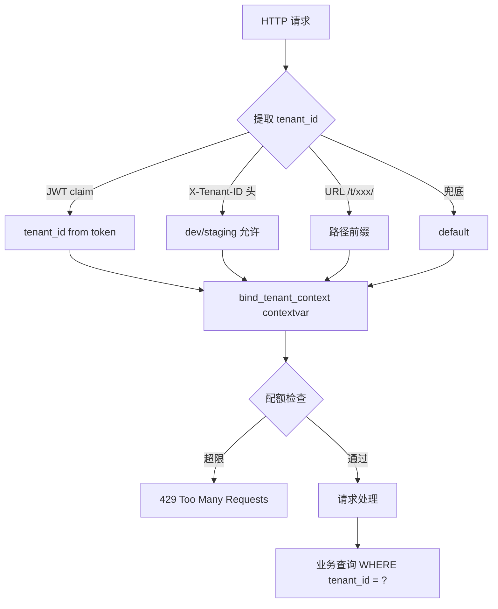

# 多租户隔离

## 三层防护设计



## 1. Tenant 提取优先级

| 优先级 | 来源 | 适用环境 |
|---|---|---|
| 1 | JWT claim 里的 `tenant_id` | 生产（强制） |
| 2 | `X-Tenant-ID` 请求头 | dev/staging/ci（生产禁止） |
| 3 | URL 路径 `/t/{tenant_id}/...` | 多租户 SaaS 路由 |
| 4 | `'default'` 兜底 | 单租户场景 |

**生产环境强制走 JWT**：`enforce_in_prod=True`，避免伪造 tenant_id 绕过隔离。

## 2. contextvar 贯穿

```python
# app/services/tenant/tenant_service.py
_tenant_id_ctx: ContextVar[Optional[str]] = ContextVar("tenant_id", default=None)

def bind_tenant_context(tenant_id: str, ...):
    _tenant_id_ctx.set(tenant_id)

def get_current_tenant() -> str:
    return _tenant_id_ctx.get() or "default"
```

**为什么用 contextvar 不用 ThreadLocal？**

- FastAPI 全异步，ThreadLocal 在协程切换时丢失上下文
- ContextVar 是 Python 3.7+ 标准库，asyncio task 友好
- 中间件入口 set，业务代码任意位置 get，零侵入

## 3. 配额检查（429 阻断）

```python
# TenantContextMiddleware.dispatch()
if request.method in {"POST", "PUT", "PATCH", "DELETE"} and quota.enabled:
    ok, reason = await tenant_quota_service.check_quota(tenant_id)
    if not ok:
        return JSONResponse(
            status_code=429,
            content={
                "detail": {
                    "code": "TENANT_QUOTA_EXCEEDED",
                    "message": f"租户配额已超限：{reason}",
                },
            },
        )
```

**配额三层指标**：

| 指标 | 默认上限 | 累计方式 |
|---|---|---|
| 日 LLM 调用次数 | 1000 | Redis hash `tenant:usage:{id}:{date}` |
| 日 token 总量 | 2,000,000 | 同上 |
| 并发任务数 | 5 | 实时计数 |

## 4. 数据隔离

**当前实现**：业务表加 `tenant_id` 列，查询带 `WHERE tenant_id = ?`。

**生产建议**：配合 PostgreSQL Row-Level Security 加强：

```sql
-- 启用 RLS
ALTER TABLE chat_sessions ENABLE ROW LEVEL SECURITY;

-- 策略：当前用户只能看到自己租户的数据
CREATE POLICY tenant_isolation ON chat_sessions
    USING (tenant_id = current_setting('app.current_tenant')::text);
```

## 5. 配额服务实现

```python
class TenantQuotaService:
    async def get_quota(self, tenant_id: str) -> TenantQuota:
        """获取配额（内存 → Redis → 默认）"""
        # 内存缓存 5 分钟
        # Redis 兜底
        # 默认配额兜底

    async def incr_usage(self, tenant_id: str, tokens: int = 0) -> tuple:
        """累加当日用量，返回 [new_calls, new_tokens]"""
        # Redis hash hincrby + expire 36h

    async def check_quota(self, tenant_id: str) -> tuple:
        """检查是否超限，返回 (ok, reason)"""
```

## 6. 与成本告警的联动

成本告警（`CostAlertService`）在每次 LLM 调用后：

1. 从 contextvar 取 `tenant_id` + `user_id`
2. 按 tenant + user 维度累加 token + 估算成本
3. 检查双层阈值（80% warning / 100% critical / 120% budget_exceeded）
4. 超过 120% 时返回 `fallback_model`（如 qwen-turbo），由 ProviderRouter 自动切换便宜模型

详见 [成本告警](../features/cost-alerts.md)。
