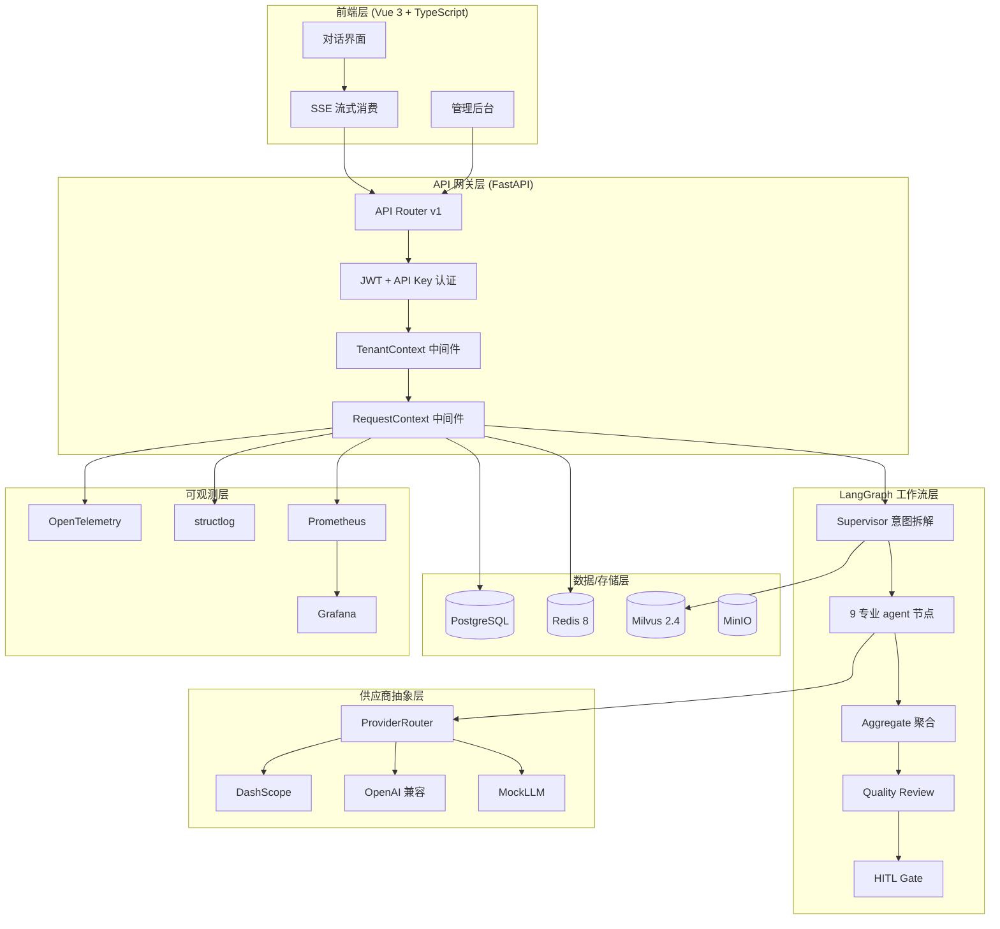
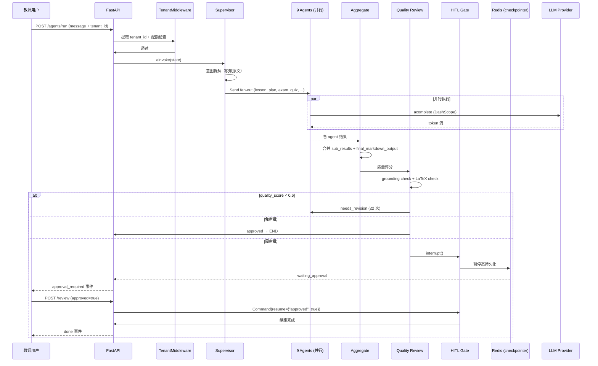

# 系统架构总览

## 分层架构

EduAgent-Platform 采用 **六层架构**，每层职责清晰、可独立演进：

## 关键设计决策

### 1. 为什么选 LangGraph 不选 AutoGen/CrewAI？

| 维度 | LangGraph | AutoGen | CrewAI |
|---|---|---|---|
| 状态机 | 显式 StateGraph + 条件边 | 隐式对话流 | 角色 pipeline |
| HITL | 原生 `interrupt()` + `Command(resume=)` | 需自实现 | 不支持 |
| 持久化 | AsyncRedisSaver checkpointer | 无 | 无 |
| 并行 | Send fan-out + aggregate | 有限 | 顺序为主 |
| 流式 | config 注入 on_token 回调 | 需包装 | 不支持 |
| 调试 | LangGraph Studio 可视化 | 黑盒 | 黑盒 |

**结论**：教学场景需要 HITL 审批 + 多 agent 并行 + 跨进程恢复，LangGraph 是唯一同时满足的方案。

### 2. 为什么用 AsyncRedisSaver 而不用 SQL 持久化？

- **HITL 跨进程恢复**：Celery worker 暂停后，FastAPI 进程要能续跑，必须共享存储
- **Redis 已有**：项目用 Redis 做任务总线和响应缓存，复用连接零成本
- **性能**：Redis checkpointer 读写 < 5ms，SQL 需 30ms+
- **降级链**：Redis 不可用时降级 MemorySaver，进程内仍可工作

### 3. 为什么 tenant_id 用 contextvar 而不用 ThreadLocal？

- **asyncio 友好**：FastAPI 全异步，ThreadLocal 在协程切换时会丢失上下文
- **ContextVar** 是 Python 3.7+ 标准库，与 asyncio task 完美兼容
- **中间件一次注入**：TenantContextMiddleware 在请求入口 set，业务代码任意位置 get

### 4. 为什么断路器不依赖 Redis？

- **故障隔离原则**：断路器本身不能成为新的故障点
- **进程内状态足够**：单个 worker 的熔断状态不必跨进程同步（每个 worker 独立观察上游健康）
- **简单可靠**：threading.Lock + monotonic 时钟，无外部依赖

## 数据流：一次完整的教学任务

## 关键模块对照表

| 模块 | 文件位置 | 关键类/函数 |
|---|---|---|
| LangGraph 图 | `backend/app/services/agent/teaching_graph.py` | `build_teaching_graph()` / `TeachingGraphRunner` |
| 9 专业 agent | `backend/app/services/agent/specialized/` | `lesson_plan.py` / `exam_quiz.py` / `socratic.py` 等 |
| 意图路由 | `backend/app/services/agent/supervisor.py` | `SupervisorAgent.route()` |
| 状态定义 | `backend/app/services/agent/state.py` | `AgentState` TypedDict |
| 多租户 | `backend/app/services/tenant/tenant_service.py` | `TenantQuotaService` / `get_current_tenant()` |
| 供应商抽象 | `backend/app/services/llm/provider.py` | `ProviderRouter` / `llm_router` |
| 成本告警 | `backend/app/services/llm/cost_alert.py` | `CostAlertService` / `cost_alert_service` |
| A/B 实验 | `backend/app/services/agent/ab_experiment.py` | `ExperimentRegistry` / `experiment_registry` |
| 断路器 | `backend/app/harness/circuit_breaker.py` | `CircuitBreaker` / `llm_breaker` |
| 沙箱 | `backend/app/services/sandbox/code_executor.py` | `SandboxCodeExecutor` / `SandboxResourceLimiter` |
| 指标端点 | `backend/app/core/metrics.py` | `/metrics` Prometheus 端点 |
| OpenTelemetry | `backend/app/core/telemetry.py` | `init_telemetry()` |
| 结构化日志 | `backend/app/core/logging.py` | `configure_logging()` / `get_logger()` |
| 异步任务 | `backend/app/core/celery_app.py` | `run_agent_workflow_task` |
| 结果落库 | `backend/app/services/task_queue/result_persistence.py` | `persist_task_result()` |
