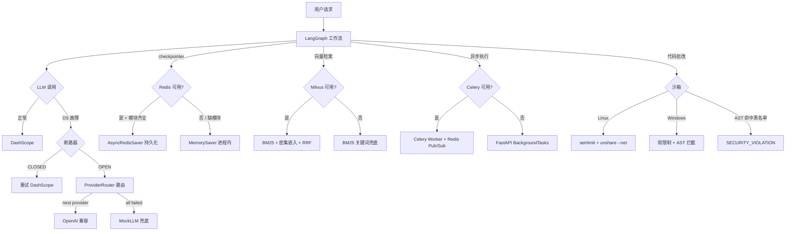
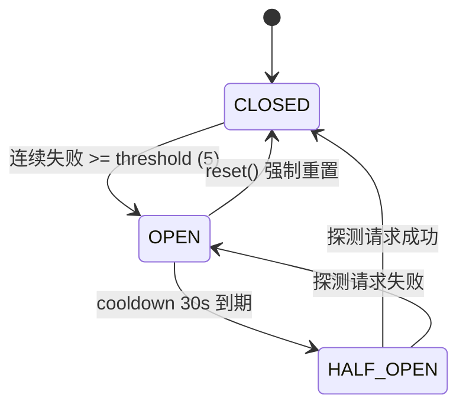
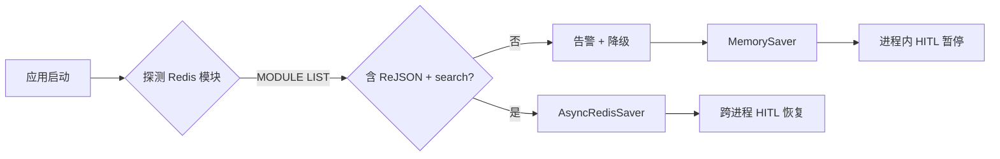

# 韧性设计

## 降级链全景



## 断路器状态机



### 状态语义

| 状态 | 行为 | 转换条件 |
|---|---|---|
| **CLOSED** | 所有请求放行，记录成功/失败 | 连续失败 >= 5 → OPEN |
| **OPEN** | 直接拒绝请求（CircuitBreakerOpenError） | cooldown 30s 到期 → HALF_OPEN |
| **HALF_OPEN** | 仅放行 1 个探测请求 | 成功 → CLOSED / 失败 → OPEN |

### 关键代码

```python
class CircuitBreaker:
    def __init__(self, name, failure_threshold=5, cooldown_seconds=30):
        ...
    
    @asynccontextmanager
    async def protect(self):
        if self.is_open:
            raise CircuitBreakerOpenError(f"[{self.name}] OPEN, cooldown remaining")
        # HALF_OPEN 限流：仅放行 1 个探测
        with self._lock:
            if self._internal.state == BreakerState.HALF_OPEN:
                if self._half_open_used >= self.half_open_probe_count:
                    raise CircuitBreakerOpenError(...)
                self._half_open_used += 1
        try:
            yield self
        except Exception:
            self.record_failure()
            raise
        else:
            self.record_success()
```

### 全局单例

| 断路器 | 阈值 | 保护对象 |
|---|---|---|
| `llm_breaker` | 5 次失败 / 30s 冷却 | DashScope LLM API |
| `mineru_breaker` | 3 次失败 / 60s 冷却 | MinerU 文档解析 API |
| 每个 ProviderRouter 路由 | 5 次 / 30s | 独立断路器（dashscope/openai_fallback/mock） |

## Redis 降级链



**关键探测代码**：

```python
async def _build_redis_saver():
    modules = await redis_manager.client.module_list()
    missing = {"ReJSON", "search"} - {m["name"] for m in modules}
    if missing:
        logger.warning(f"Redis 缺少模块 {missing}，降级 MemorySaver")
        return None
    
    # 独立字节协议连接（避免与 redis_manager 文本协议冲突）
    client = aioredis.Redis.from_url(_redis_url(), decode_responses=False)
    saver = AsyncRedisSaver(redis_client=client)
    await saver.asetup()  # 幂等创建索引
    return saver
```

## Celery 任务重投递

```python
@celery_app.task(bind=True, max_retries=2, default_retry_delay=10)
def run_agent_workflow_task(self, ...):
    try:
        result = loop.run_until_complete(_async_run_workflow(...))
        return result
    except Exception as e:
        # 推送 error 事件
        loop.run_until_complete(_publish_event(task_id, {
            "event_type": "error",
            "payload": {"error": str(e)}
        }))
        # 指数退避重试：10 * (retries + 1)
        raise self.retry(exc=e, countdown=10 * (self.request.retries + 1))
```

**配置要点**：

- `task_acks_late=True`：任务完成才 ack，崩溃时自动重投递
- `task_reject_on_worker_lost=True`：worker 崩溃时任务回到队列
- `broker_transport_options={"visibility_timeout": 1800}`：30 分钟可见性超时，防止重复消费
- `worker_prefetch_multiplier=1`：长任务场景避免一个 worker 抢占过多任务
- `worker_max_tasks_per_child=200`：防止内存泄漏

## 沙箱安全加固

### AST 静态分析（已有）

```python
FORBIDDEN_MODULES = {
    "os", "sys", "subprocess", "socket", "shutil", "importlib",
    "pathlib", "pty", "ctypes", "multiprocessing", "threading", "signal",
}
FORBIDDEN_CALLS = {"eval", "exec", "compile", "__import__", "open", "input"}
```

### 资源限制（P4-23）

```python
class SandboxResourceLimiter:
    # Linux: setrlimit + unshare --net
    def _linux_prelude(self):
        return f"""
import resource
resource.setrlimit(resource.RLIMIT_CPU, ({self.cpu_seconds}, ...))
resource.setrlimit(resource.RLIMIT_AS, ({self.memory_mb} * 1024 * 1024, ...))
resource.setrlimit(resource.RLIMIT_FSIZE, ...)
resource.setrlimit(resource.RLIMIT_NPROC, ...)
"""
    
    def wrap_command(self, cmd):
        # unshare --net 让子进程没有网络接口（完全离线）
        return [unshare, "--net", "--pid", "--fork", "--mount-proc", *cmd]
```

**默认限制**：

| 资源 | 上限 | 说明 |
|---|---|---|
| CPU 时间 | 5s | 单测 CPU 时间 |
| 内存 | 256MB | 地址空间 |
| 文件大小 | 1MB | 单文件写入上限 |
| 进程数 | 1 | 不允许 fork |
| 网络 | 完全离线 | 白名单为空 |

## 故障注入测试

12 个韧性测试用例覆盖（`backend/tests/test_resilience.py`）：

| 测试 | 验证 |
|---|---|
| 断路器 OPEN/HALF_OPEN/CLOSED 状态机 | 4 个 |
| Redis 断开降级 MemorySaver | 1 个 |
| DashScope 配额耗尽友好错误 | 1 个 |
| 响应缓存黑名单（UUID/时间戳） | 1 个 |
| 响应缓存精确命中 | 1 个 |
| 响应缓存 TTL 过期 | 1 个 |
| Celery 任务重试 | 1 个 |
| /metrics 端点导出断路器状态 | 2 个 |
