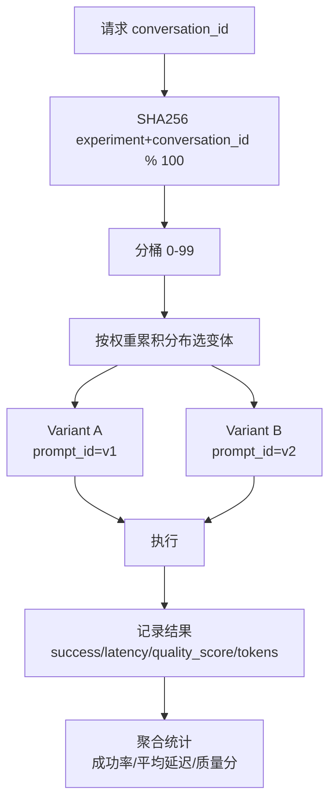

# A/B 实验

## 框架设计



## 稳定分桶

```python
def assign(experiment_name, conversation_id):
    key = f"{experiment_name}:{conversation_id}"
    h = hashlib.sha256(key.encode("utf-8")).hexdigest()
    bucket = int(h[:8], 16) % 100  # 0-99
    
    # 按权重累积分布选变体
    cumulative = 0
    for variant in config.variants:
        cumulative += variant.weight * 100 // total_weight
        if bucket < cumulative:
            return variant
```

**特点**：同一 conversation_id 始终命中同一变体（稳定分桶），避免结果跳变。

## 内置实验

| 实验名 | 对比 | 默认状态 |
|---|---|---|
| `lesson_plan_prompt_concise` | 详细指令 vs 精简指令 | 关闭 |
| `multi_agent_vs_single` | 单 agent vs 双 agent 协作 | 关闭 |

## 变体执行结果聚合

通过 `GET /api/v1/agents/experiments` 端点暴露：

```json
{
  "experiments": {
    "lesson_plan_prompt_concise": {
      "control": {
        "sample_size": 50,
        "success_rate": 0.96,
        "avg_latency_ms": 2340,
        "avg_quality_score": 0.82,
        "total_tokens": 125000
      },
      "treatment": {
        "sample_size": 50,
        "success_rate": 0.98,
        "avg_latency_ms": 1980,
        "avg_quality_score": 0.85,
        "total_tokens": 98000
      }
    }
  }
}
```

## 应用场景

- 不同 prompt 版本对比（A：详细指令 vs B：精简指令）
- 不同 agent 组合对比（A：lesson_plan 单独 vs B：lesson_plan + rubric 双 agent）
- 不同 LLM 模型对比（A：qwen-max vs B：qwen-turbo）
- 不同温度参数对比（A：T=0.3 vs B：T=0.7）
