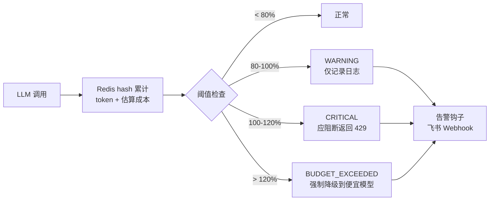

# 成本告警

## 多级响应



## 双层阈值

| 维度 | 指标 | warning | critical | budget_exceeded |
|---|---|---|---|---|
| 租户 | 日 token | 160 万 | 200 万 | 240 万 |
| 租户 | 日成本 (CNY) | ¥80 | ¥100 | ¥120 |
| 用户 | 日 token | 8 万 | 10 万 | 12 万 |
| 用户 | 日成本 (CNY) | ¥8 | ¥10 | ¥12 |

## 模型单价表

| 模型 | prompt (CNY/1K) | completion (CNY/1K) |
|---|---|---|
| qwen-max | 0.040 | 0.120 |
| qwen-plus | 0.0008 | 0.002 |
| qwen-turbo | 0.0003 | 0.0006 |
| gpt-4o | 0.018 | 0.072 |
| gpt-4o-mini | 0.001 | 0.003 |

## 强制降级

超过 120% 阈值时，`CostAlertService` 返回 `fallback_model`（默认 `qwen-turbo`），由 `ProviderRouter` 自动切换：

```python
result = await cost_alert_service.record_usage(
    tenant_id="tenant-a",
    user_id="u-001",
    model="qwen-max",
    prompt_tokens=2000,
    completion_tokens=5000,
)

if result["fallback_model"]:
    # 强制降级到便宜模型
    response = await llm_router.acomplete(
        messages, model=result["fallback_model"]
    )
```

## 告警钩子

| 钩子 | 用途 | 配置 |
|---|---|---|
| `feishu_webhook_hook` | 飞书机器人推送 | `FEISHU_WEBHOOK_URL` |
| (自定义) | PagerDuty / 钉钉 / Email | `cost_alert_service.add_hook(your_hook)` |

## 去重窗口

同一 (scope, tenant_id, user_id, level, metric) 5 分钟内不重复告警，避免告警风暴。
