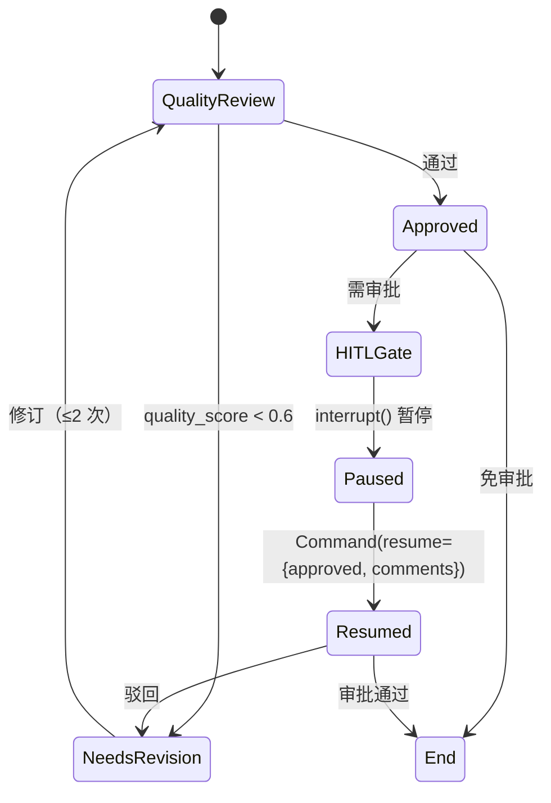

# HITL 审批

## 工作流



## LangGraph 1.x 原生 interrupt

```python
async def hitl_gate_node(state: AgentState) -> Dict[str, Any]:
    # interrupt() 函数式暂停，会抛 NodeInterrupt
    decision = interrupt({
        "type": "teaching_approval",
        "output": state.get("final_markdown_output", ""),
        "quality_score": state.get("quality_score", 0.0),
        "artifact": state.get("structured_artifact"),
    })
    
    approved = bool((decision or {}).get("approved", False))
    comments = (decision or {}).get("comments")
    
    return {
        "is_approved": approved,
        "reviewer_comments": comments,
        "needs_revision": not approved,
    }
```

## 恢复方式

```python
# TeachingGraphRunner.resume()
final_state = await graph.ainvoke(
    Command(resume={"approved": approved, "comments": comments}),
    config=config,  # 含 thread_id 关联到暂停的会话
)
```

## 持久化与跨进程恢复

| Checkpointer | 跨进程恢复 | 持久性 |
|---|---|---|
| AsyncRedisSaver (Redis 8+) | ✓ Celery 暂停 → FastAPI 续跑 | 持久 |
| MemorySaver | ✗ 仅进程内 | 进程重启即丢 |

详见 [系统架构 → LangGraph 工作流 → Checkpointer 持久化](../architecture/langgraph-flow.md#checkpointer-持久化)。
