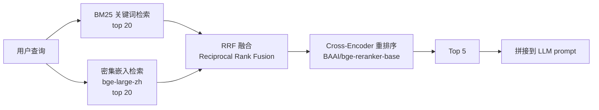

# RAG 混合检索

## 检索流水线



## 三阶段检索

### 1. BM25 关键词检索（稀疏）

- 算法：Okapi BM25
- 召回：top 20
- 优势：精确匹配关键词，对中文专有名词友好

### 2. 密集嵌入检索（稠密）

- 模型：`BAAI/bge-large-zh` (1024 维)
- 向量库：Milvus 2.4 (HNSW 索引)
- 召回：top 20
- 优势：语义匹配，能找到换说法的内容

### 3. RRF 融合

```python
def rrf_fuse(bm25_results, dense_results, k=60):
    """
    Reciprocal Rank Fusion：
    score = sum(1 / (k + rank_in_each_list))
    """
    scores = {}
    for rank, doc in enumerate(bm25_results):
        scores[doc.id] = scores.get(doc.id, 0) + 1 / (k + rank + 1)
    for rank, doc in enumerate(dense_results):
        scores[doc.id] = scores.get(doc.id, 0) + 1 / (k + rank + 1)
    return sorted(scores.items(), key=lambda x: -x[1])[:20]
```

### 4. Cross-Encoder 重排序

- 模型：`BAAI/bge-reranker-base`
- 输入：(query, document) 对
- 输出：相关性分数 0-1
- 优势：比 bi-encoder 更准（交叉注意力），但慢（仅对 top 20 重排）

## 降级链

| 条件 | 降级方案 |
|---|---|
| Milvus 不可用 | 仅走 BM25 关键词检索 |
| Milvus + BM25 都不可用 | 走 LLM 自由生成（无 grounding） |
| Cross-Encoder 模型加载失败 | 跳过重排序，直接用 RRF 排序 |
