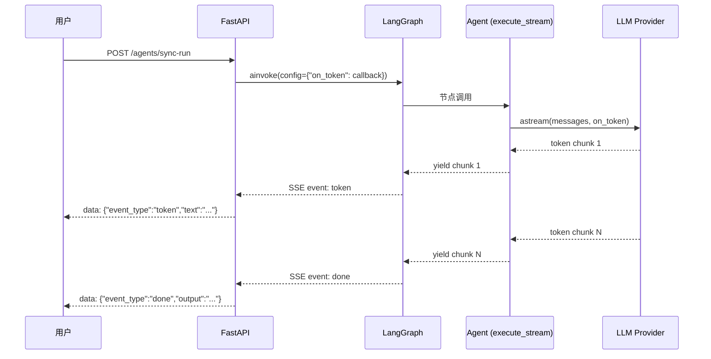

# 流式生成

## 真 token 流



## TokenCounter 补偿

仅实现 `execute`（非流式）的 agent（如 socratic/math_solver）：

```python
async def _execute_with_stream(agent, agent_name, state, config):
    token_counter = TokenCounter(on_token)
    
    # 调用 agent.execute（非流式）
    result = await agent.execute_stream(state, on_token=token_counter)
    
    # 如果全程无真实 token（agent 只实现了 execute）
    # → 对最终文本分片补发打字机
    await token_counter.compensate_if_silent(result["output"])
```

## SSE 事件类型

| event_type | 触发时机 | payload |
|---|---|---|
| `token` | LLM 流式 chunk | `{text, agent}` |
| `trace` | 节点开始/结束 | `{node_name, title, action, elapsed_ms}` |
| `node_start` | LangGraph 节点入口 | `{node}` |
| `node_end` | LangGraph 节点出口 | `{node, elapsed_ms, retry_count, quality_score}` |
| `approval_required` | HITL 暂停 | `{task_id, output, quality_score, artifact}` |
| `done` | 任务完成 | `{output, citations, trace_summary}` |
| `error` | 任务失败 | `{error, task_id}` |
