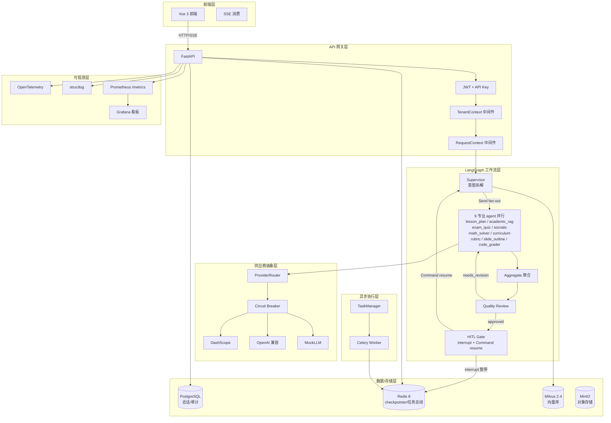

# EduAgent-Platform

> 企业级教学多智能体平台 — 基于 LangGraph 1.x 编排 9 个专业教学 agent，
> 提供教案生成 / 学术 RAG / 试卷组卷 / 苏格拉底提问 / 代码批改等能力，
> 面向 K12 与高校教师，支持多租户隔离、HITL 审批、成本告警。

## 核心能力

- :material-graph: **LangGraph 1.x 工作流**：意图拆解 → 9 agent 并行 Send → aggregate → quality_review → HITL 暂停/续跑
- :material-lightning-bolt: **真 token 流**：SSE 推送 + 非流式 agent TokenCounter 补偿
- :material-shield-check: **多租户隔离**：tenant_id contextvar + 配额 429 阻断 + 数据隔离
- :material-cash-alert: **成本告警**：双层阈值（tenant/user × token/cost）+ 多级响应（warning/critical/降级）
- :material-flask: **RAG 混合检索**：BM25 + 密集嵌入 + RRF 融合 + Cross-Encoder 重排序
- :material-chart-line: **可观测性**：OpenTelemetry + structlog + Prometheus + Grafana 看板
- :material-test-tube: **A/B 实验**：SHA256 稳定分桶 + 变体结果聚合
- :material-bug-check: **韧性设计**：断路器（CLOSED/OPEN/HALF_OPEN）+ Redis 降级 + Celery 重投递

## 架构总览

## 改进批次全景

| 批次 | 主题 | 关键产出 |
|---|---|---|
| P0 | 教学智能体主链路接入 | LangGraph teaching graph + 9 agent + HITL 审批 |
| P1 | 工程化升级 | LangGraph 1.x + RedisSaver 持久化 + 原生 interrupt + 图可观测性 |
| P2 | 工程化基础设施 | CI/CD + Alembic + structlog + OpenTelemetry + OpenAPI 定制 |
| P3 | 生产可观测性与韧性 | LLM 成本看板 + 响应缓存 + 压测脚本 + 断路器 + 韧性测试 |
| P4 | 差异化亮点 | 模型供应商抽象 + 沙箱加固 + 多租户 + A/B 实验 + 成本告警 |

## 技术栈

| 层 | 技术 |
|---|---|
| 前端 | Vue 3 + TypeScript + Vite + Pinia |
| 后端 | FastAPI + Pydantic 2 + SQLAlchemy 2 (async) |
| 工作流 | LangGraph 1.2.11 + langchain-core 1.6.3 |
| 异步 | Celery 5 + Redis 8 (broker/backend) |
| 持久化 | PostgreSQL 16 (生产) / SQLite (本地) |
| 向量库 | Milvus 2.4 + bge-reranker-base 重排序 |
| LLM | 阿里云 DashScope (qwen 系列) + OpenAI 兼容兜底 |
| 缓存 | Redis 8 (AsyncRedisSaver checkpointer + 响应缓存) |
| 可观测 | OpenTelemetry + structlog + Prometheus + Grafana |
| 部署 | Docker Compose + GitHub Actions CI/CD |

## 文档导航

- **第一次使用？** → [快速开始](getting-started/installation.md)
- **想了解架构？** → [系统架构总览](architecture/overview.md)
- **API 集成？** → [API 参考](api/overview.md)
- **面试准备？** → [技术选型理由](interview/design-decisions.md)
