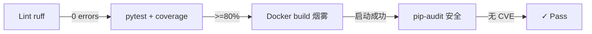

# CI/CD 流水线

## GitHub Actions 工作流

| Workflow | 触发 | 阶段 |
|---|---|---|
| `ci.yml` | push 到 main/PR | ruff lint → pytest + 覆盖率 → Docker 烟雾测试 → pip-audit 安全扫描 |
| `docs.yml` | push 到 main（docs/ 或 mkdocs.yml 变更） | MkDocs 构建 → 部署到 GitHub Pages |

## ci.yml 4 阶段



### 阶段 1：ruff lint

- 规则集：E/F/W（错误/告警/语义）
- 渐进迁移：I/B/SIM/UP 规则暂留作 P3 阶段清理
- 失败条件：任何 E/F/W 错误

### 阶段 2：pytest + 覆盖率

- 测试目录：`backend/tests/`
- 覆盖率报告：`backend/coverage.xml` + Codecov 上传
- 失败条件：测试失败 或 覆盖率 < 80%
- CI 环境变量：
  - `ENVIRONMENT=ci`
  - `DASHSCOPE_API_KEY=`（空触发 MockLLM）
  - `MILVUS_HOST=`（空触发 BM25 兜底）
  - `OTEL_TRACES_EXPORTER=none`

### 阶段 3：Docker 烟雾测试

- 构建 `eduagent-backend:ci` 镜像
- 启动 + 等待 `/readyz` 返回 200（超时 60s）
- 验证 OpenAPI 文档可访问

### 阶段 4：pip-audit 安全扫描

- 扫描 `requirements.txt` 中的依赖
- 失败条件：发现 CVE 漏洞

## docs.yml

- 触发：push 到 main，仅 `docs/**` 或 `mkdocs.yml` 变更
- 构建：`mkdocs build --strict --verbose`
- 部署：`mkdocs gh-deploy --force --no-history`（推送到 gh-pages 分支）
- 访问：`https://jiaxiaojia123789.github.io/EduAgent-Platform/`

## 本地复现 CI

```bash
# 复现 CI 环境
$env:ENVIRONMENT="ci"
$env:DASHSCOPE_API_KEY=""
$env:SECRET_KEY="ci-only-secret-key-32-chars-padding!!"
$env:DATABASE_URL="sqlite+aiosqlite:///./data/ci_test.db"
$env:REDIS_HOST="localhost"
$env:MILVUS_HOST=""
$env:OTEL_TRACES_EXPORTER="none"

# 跑 ruff
python -m ruff check app tests

# 跑 pytest
python -m pytest tests/ --cov=app --cov-report=xml

# 跑 pip-audit
pip install pip-audit
pip-audit -r requirements.txt
```

## 已知限制

- `test_code_grader_agent_workflow` 因 DashScope 免费额度耗尽持续失败（与代码无关，标记 xfail）
- Docker 烟雾测试仅在 Linux runner 上跑（Windows Docker Desktop 兼容性差）
- pip-audit 不会阻断已知白名单漏洞（如有，在 `pyproject.toml` 配置 `[tool.pip-audit] ignore-vuln`）
