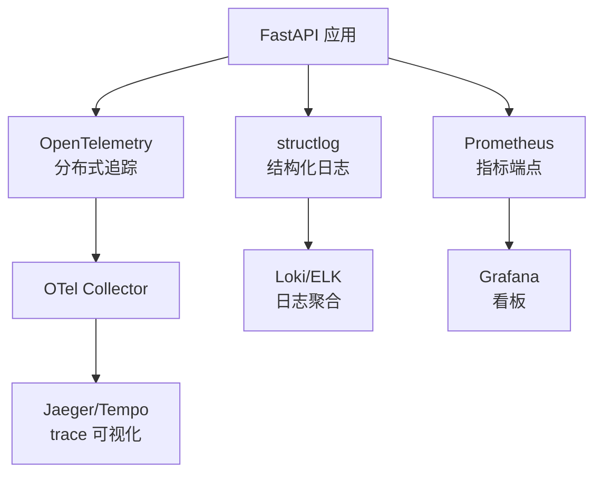

# 可观测性

## 三层可观测体系



## 1. OpenTelemetry 分布式追踪

### 自动埋点

| 库 | 埋点范围 |
|---|---|
| FastAPI | HTTP 请求/响应 span |
| httpx | 出站 HTTP 调用（DashScope/OpenAI） |
| SQLAlchemy | DB 查询 span |
| Redis | Redis 命令 span |
| LangGraph | 节点级 span（_with_node_metrics） |

### trace_id 贯穿

```python
# RequestContextMiddleware 注入 request_id
# _LogCorrelationProcessor 同步 OTel trace_id 到 structlog contextvar
# 最终：每条日志带 trace_id + request_id + user_id
```

### 配置

```env
# 生产环境：导出到 OTel Collector
OTEL_EXPORTER_OTLP_ENDPOINT=http://otel-collector:4317
OTEL_TRACES_EXPORTER=otlp

# CI 环境：关闭追踪
OTEL_TRACES_EXPORTER=none
```

## 2. structlog 结构化日志

### 关键字段

```json
{
  "timestamp": "2026-09-28T10:00:00Z",
  "level": "info",
  "logger": "app.api.v1.agents",
  "event": "agent_task_submitted",
  "request_id": "req-abc123",
  "trace_id": "0af..., span_id": "...",
  "user_id": "u-001",
  "tenant_id": "default",
  "agent_type": "lesson_plan",
  "task_id": "task-xxx"
}
```

### 脱敏

敏感字段（API Key / Password / Token）通过 `make_filtering_logger` 自动脱敏为 `***`。

## 3. Prometheus 指标

### 端点

`GET /metrics`（无需认证，便于 Prometheus 抓取）

### 指标清单

| 指标 | 类型 | 标签 | 用途 |
|---|---|---|---|
| `edu_agent_info` | gauge | version,env | 服务元信息 |
| `edu_agent_dependency_up` | gauge | dependency | milvus/redis 连接状态 |
| `edu_agent_checkpointer_backend` | gauge | backend | redis=1/memory=0 |
| `edu_agent_circuit_breaker_state` | gauge | breaker | 1=CLOSED 0.5=HALF_OPEN 0=OPEN |
| `edu_agent_circuit_breaker_failures` | gauge | breaker | 连续失败计数 |
| `edu_agent_llm_provider_state` | gauge | provider,priority | LLM 供应商断路器状态 |
| `edu_agent_llm_calls_total` | counter | agent | LLM 调用次数 |
| `edu_agent_llm_cached_calls_total` | counter | agent | 缓存命中次数 |
| `edu_agent_llm_cache_hit_rate` | gauge | agent | 缓存命中率 0-1 |
| `edu_agent_llm_error_rate` | gauge | agent | 错误率 0-1 |
| `edu_agent_llm_latency_avg_ms` | gauge | agent | 平均延迟 |
| `edu_agent_llm_latency_p50_ms` | gauge | agent | p50 延迟 |
| `edu_agent_llm_latency_p95_ms` | gauge | agent | p95 延迟 |
| `edu_agent_llm_tokens_total` | counter | agent | token 总量 |

### PromQL 示例

```promql
# LLM 调用速率（每秒）
rate(edu_agent_llm_calls_total[1m])

# p95 延迟
edu_agent_llm_latency_p95_ms{agent="lesson_plan"}

# 缓存命中率
edu_agent_llm_cache_hit_rate{agent="lesson_plan"}

# 断路器是否 OPEN（alert 触发条件）
edu_agent_circuit_breaker_state{breaker="dashscope_llm"} == 0
```

## 4. Grafana 看板

详见 [部署 → Grafana](deployment.md#grafana-看板)。

## 5. 关键告警规则

| 告警 | PromQL | 阈值 |
|---|---|---|
| LLM 断路器 OPEN | `edu_agent_circuit_breaker_state == 0` | 持续 1m |
| Redis 不可用 | `edu_agent_dependency_up{dependency="redis"} == 0` | 持续 30s |
| Checkpointer 降级 | `edu_agent_checkpointer_backend{backend="memory"} == 1` | 持续 5m |
| LLM 错误率高 | `edu_agent_llm_error_rate > 0.1` | 持续 2m |
| p95 延迟超阈值 | `edu_agent_llm_latency_p95_ms > 5000` | 持续 5m |
